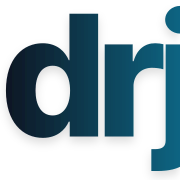

# 🕊️ DarijaCode
 
A programming language written in Moroccan Darija, built from the ground up in Rust. ( [Go to installation](#Installation) )
 
[Issues](https://github.com/krnl0xsns1nk/DarijaCode/issues) [Last commit](https://github.com/krnl0xsns1nk/DarijaCode/commits) [Top language](https://github.com/krnl0xsns1nk/DarijaCode) [Languages count](https://github.com/krnl0xsns1nk/DarijaCode)
[](LICENSE)
 
 
## What is DarijaCode?
 
DarijaCode is an independent programming language built around Moroccan Darija.
 
It is not a JavaScript library, a Python wrapper, a Node.js runtime, or a layer on top of another programming language.
 
The goal is simple:
 
**Build an actual programming language.**
 
DarijaCode has its own syntax, lexer, parser, compiler, bytecode format, and virtual machine. The project is written in Rust and is designed to eventually become a complete language and ecosystem of its own.
 
And yes — it is being built for fun.
 
But "for fun" does not mean "fake."
 
The long-term goal is for people to actually use DarijaCode to build things.
 
## Philosophy
 
DarijaCode exists because building a programming language is interesting.
 
Instead of building another language that ultimately translates everything into JavaScript, Python, C, or another existing runtime, DarijaCode is being developed as an independent language.
 
We want to understand what happens when we build the pieces ourselves:
 
 
- Our own syntax.
 
- Our own lexer.
 
- Our own parser.
 
- Our own AST.
 
- Our own compiler.
 
- Our own bytecode.
 
- Our own virtual machine.
 
- Eventually, our own ecosystem.
 

 
There is no promise that DarijaCode will become the next huge programming language.
 
There does not need to be one.
 
It is an experiment, a serious software project, and an excuse to build something from the ground up.
 
If you know how to program and want to use DarijaCode to build something, **please do.**
 
That is one of the things this project hopes for.
 
## How it works
 
DarijaCode source files use the `.drj` extension.
 
A simplified view of the current architecture looks like this:

 `
 DarijaCode source
 │
 ▼
 Lexer
 │
 ▼
 Parser
 │
 ▼
 AST
 │
 ▼
 Bytecode Compiler
 │
 ▼
 DarijaCode Bytecode
 │
 ▼
 DarijaCode VM
 │
 ▼
 Program
 ` 
The compiler and virtual machine are written in Rust.
 
The compiler transforms DarijaCode source code into DarijaCode bytecode. The custom virtual machine then executes that bytecode.
 
This means DarijaCode does not need Node.js, Python, or another programming language's runtime to execute a DarijaCode program.
 
The bytecode format and VM are internal implementation details for now and may change as the language evolves.
 
## Example
 
A minimal DarijaCode program:
 `kteb("wafin, al3alam!") ` 
Running it:
 `drj hello.drj ` 
produces:
 `wafin, al3alam!` 
The language is still very early, so the available syntax is intentionally small.
 
Expect things to change.
 
# Installation
 
Prebuilt DarijaCode binaries are published with GitHub Releases for supported platforms.
 
### Linux, macOS, and Android / Termux
 
The easiest way to install DarijaCode is using the installer:

```
curl -fsSL https://raw.githubusercontent.com/krnl0xsns1nk/DarijaCode/master/install.sh | bash
``` 
 
The installer detects the operating system and CPU architecture, finds the latest DarijaCode release, downloads the appropriate binary, and installs it as:
 `~/.local/bin/drj ` 
After installation:
 `drj program.drj ` 
If `~/.local/bin` is not already in your `PATH`, the installer will tell you how to add it.
 
### Windows
 
Windows users can download the appropriate prebuilt executable directly from the latest GitHub Release.
 
Available Windows builds include:
 `drj-windows-x86_64.exe drj-windows-aarch64.exe ` 
Download the executable for your system and place it somewhere on your `PATH`.
 
Then you can run:
 `drj.exe program.drj ` 
### Manual installation
 
All released binaries are available from the project's Releases page.
 
Choose the binary matching your operating system and architecture, make it executable where necessary, and place it somewhere available through your `PATH`.
 
The release system currently provides builds for multiple Linux, macOS, Windows, and Android architectures.
 
## Building from source
 
DarijaCode is written in Rust.
 
To build the project from source, install a recent stable Rust toolchain and clone the repository:
 
 ```bash
 git clone https://github.com/krnl0xsns1nk/DarijaCode.git
 cd DarijaCode
 cargo build --release  # Build it with Cargo:
 ```

The resulting executable will be located under:
 `target/release/drj ` 
Then Copy/Move the file to your PATh or bin path or keep it or whatever you want.

You can also run DarijaCode directly during development:
 `cargo run -- program.drj ` 
For more information about working on the compiler itself, see:
 
 
- `DEVELOPER.md`
 
- `CONTRIBUTING.md`
 

 
## Documentation
 
The main documentation site is being developed separately.
 
**Documentation site:** `https://github.com/krnl0xsns1nk/DarijaCode-website`
 
 
Documentation site coming soon.
 
 
If you already know how to program and want to understand the language or compiler, the repository itself is also a good place to explore while the documentation is being developed.
 
If you're completely new to programming, the repository probably isn't the best place to start yet.
 
That's okay.
 
DarijaCode is not trying to replace programming education. It is trying to be a programming language.
 
## Open source
 
DarijaCode is open source.
 
You can read the source code, modify it, fork it, experiment with it, and build projects with it according to the terms of the project's AGPL license.
 
If you want to build something with DarijaCode, go ahead.
 
If you want to experiment with the compiler, go ahead.
 
If you want to create a library, tool, editor integration, or something completely unexpected, even better.
 
The project is meant to be used, not just looked at.
 
## Contributing
 
Contributions are welcome.
 
You can contribute to the compiler, VM, parser, lexer, tooling, documentation, examples, tests, editor support, or other parts of the ecosystem.
 
Before contributing, read:
 
 
- `CONTRIBUTING.md`
 
- `DEVELOPER.md`
 

 
For larger changes, opening an issue first is usually a good idea so the direction can be discussed before significant work is done.
 
## Development status
 
DarijaCode is **experimental and under active development**.
 
The language is not feature-complete and compatibility between versions is not guaranteed yet.
 
The compiler, bytecode format, VM, syntax, standard library, and tooling may change substantially.
 
Current releases should be considered early development releases.
 
## License
 
DarijaCode is free and open-source software licensed under the **GNU Affero General Public License (AGPL)**.
 
See `LICENSE` for the complete license text.
 
## Links
 
 
- [GitHub repository](https://github.com/krnl0xsns1nk/DarijaCode)
 
- [Releases](https://github.com/krnl0xsns1nk/DarijaCode/releases)
 
- [Issues](https://github.com/krnl0xsns1nk/DarijaCode/issues)
 
- [Contributing](./CONTRIBUTING.md)
 
- [Developer guide](./DEVELOPPER.md)
 
- [Documentation site repository](https://github.com/krnl0xsns1nk/DarijaCode-website)
 

 
 
**Built for fun. Built seriously. Built from scratch.**
